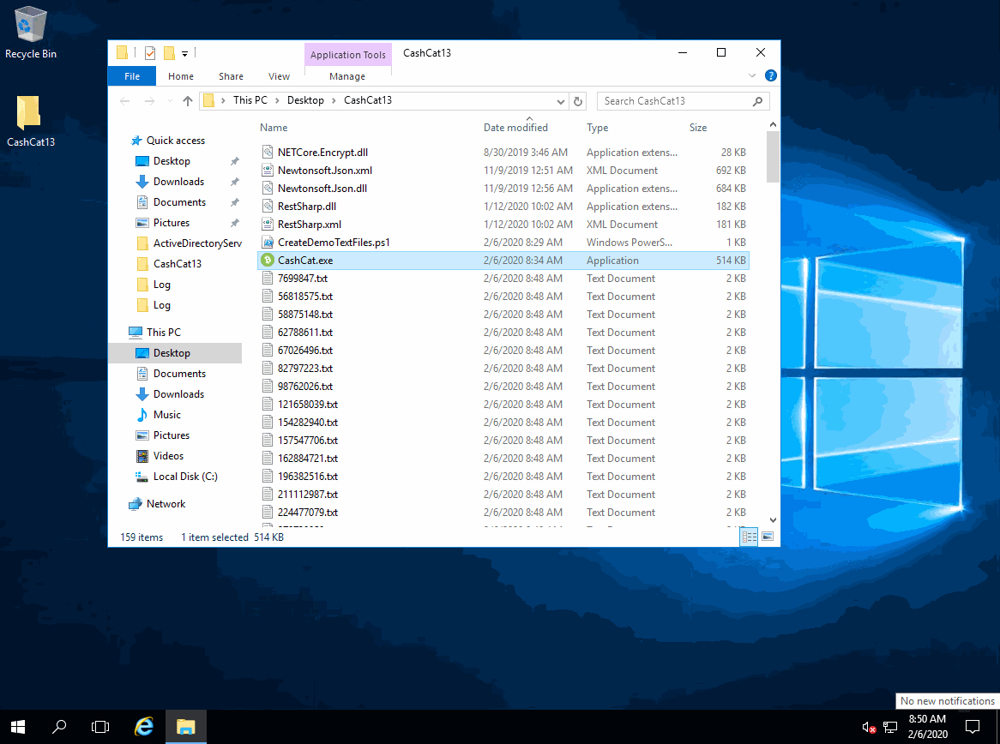

Cashcat : The "Ransomware" Simulator 🤑🐈
==================
A simple standalone "ransomware-like" simulator for Windows that will rename .TXT files to a known ransomware extension to **simulate** ransomware behavior for demos and testing various file monitoring tools and response systems. 

## Download
Visit the releases section on this repository: https://github.com/leeberg/CashCatRansomwareSimulator/releases

## VERY IMPORTANT NOTE
THIS IS **NOT** REAL RANSOMWARE! IT LITERALLY DOES NOT MATCH ANY REAL DEFINITION OF RANSOMWARE! ALL IT DOES IS RENAME files with the extension of .TXT to a ransomware extension to test ransomwware detection tools. nothing. is. encrypted.

## Usage
1. Build/Download CashCat.exe - **NEVER PLACE IN A PRODUCTION ENVIRONMENT**
2. Place CashCat.exe in a directory with some .txt files in the same directory.
3. Run Cashcast.exe.
4. All .TXT files located in the same directory as Cashcat.exe will be renamed to a common ransomware extension. No files are ACTUALLY encrypted - they are simply renamed.
5. Enter the code 123456789 to rename all ransomware files to .TXT (this effectively UNLOCKS your files / resets your demo)

## Demo

## Requirements
+ Tested on Windows 7, 10, Server 2012R2, 2016+ 
+ Requires: .NET 4.7.2

## Todo
+ Re-Implement extra configuration features without the need for dependency dlls
