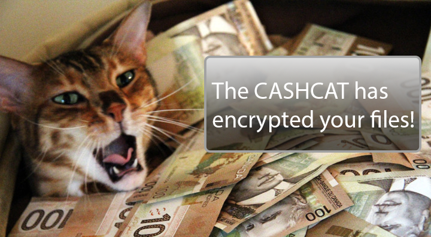
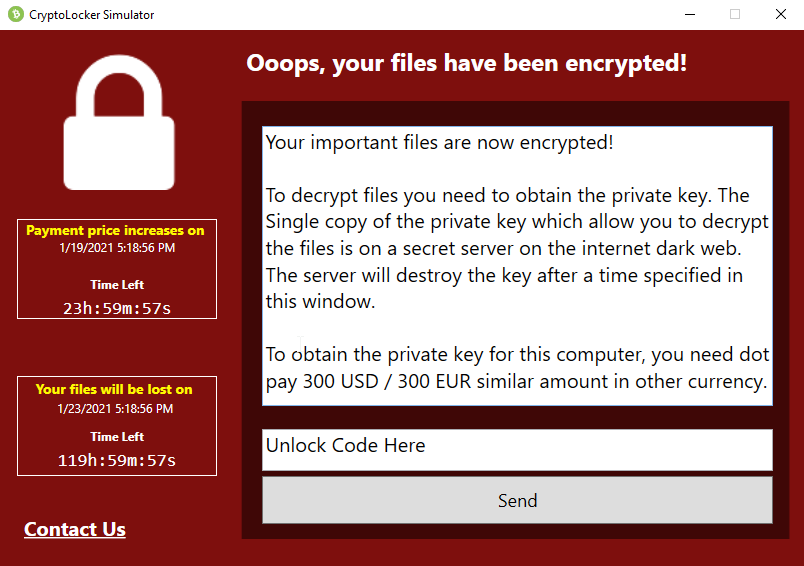
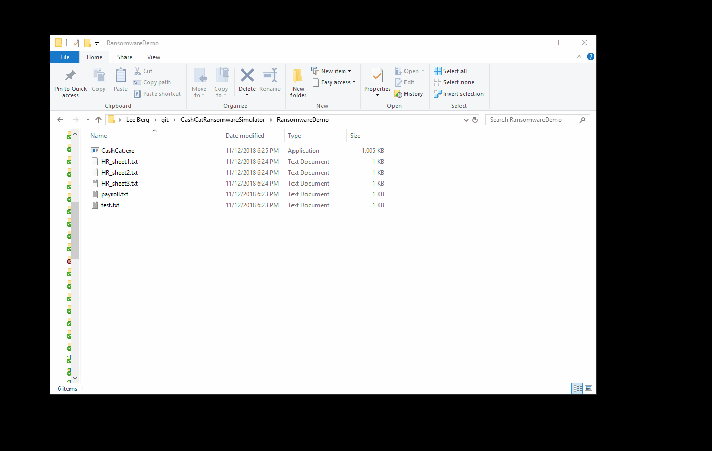

Cashcat : The "Ransomware" Simulator
==================
A little "ransomware-like" simulator for Windows that will rename .TXT files to .LOCKY to simulate ransomware behavior for testing various file monitoring tools and response systems.

  
Cashcat from: http://cashcats.biz/

## VERY IMPORTANT NOTE
THIS IS **NOT** REAL RANSOMWARE! IT LITERALLY DOES NOT MATCH ANY REAL DEFINITION OF RANSOMWARE! ALL IT DOES IS RENAME files with the extension of .TXT to .LOCKY to test file activity monitoring tools.

## Usage
1. Build/Download CashCat.exe 
2. Place CashCat.exe in a directory with some .txt files in the same directory.
3. Run Cashcast.exe.
4. All .TXT files located in the same directory as Cashcat.exe will be renamed to .Locky - a common ransomware extension
5. Enter the code 123456789 to rename all .LOCKY files to .TXT (this effectively UNLOCKS your files / resets your demo)

## UI

## Demo

## Requirements
+ Tested on Windows 7, 10, Server 2012R2, 2016+ 
+ Requires at least .NET 4.6.1
